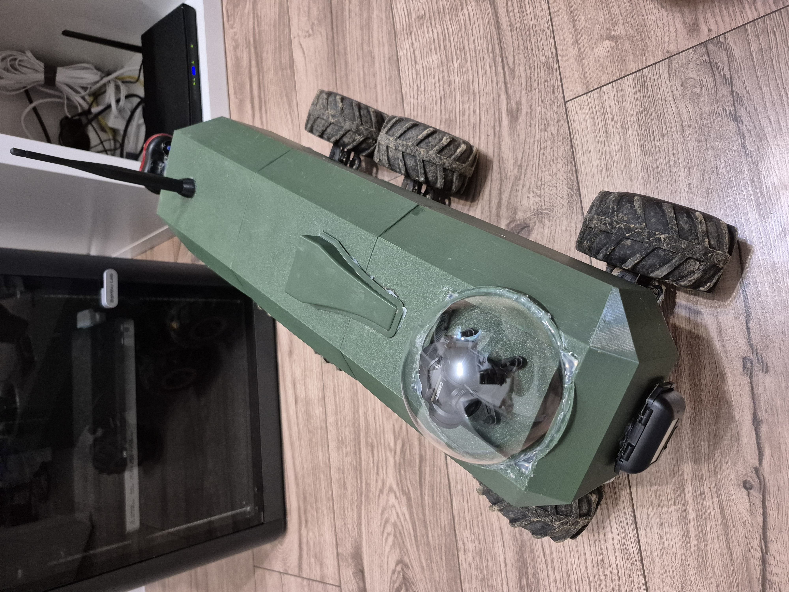
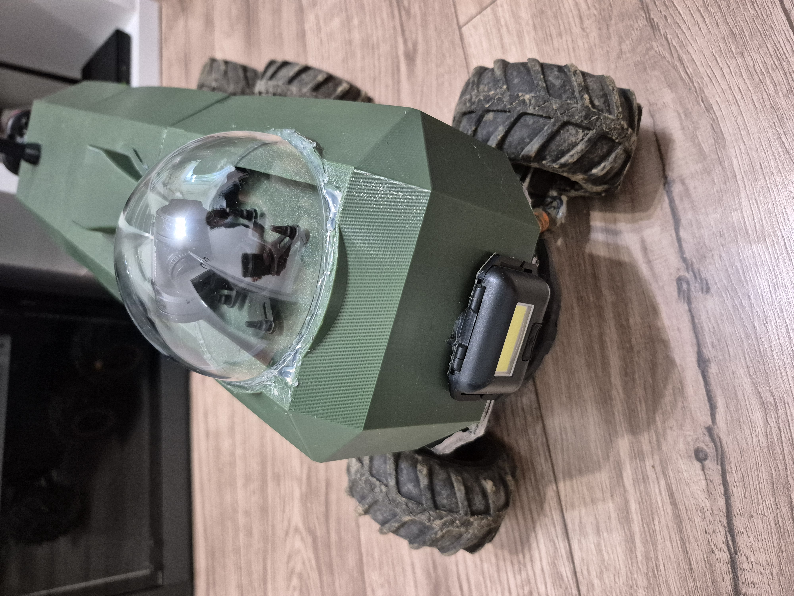
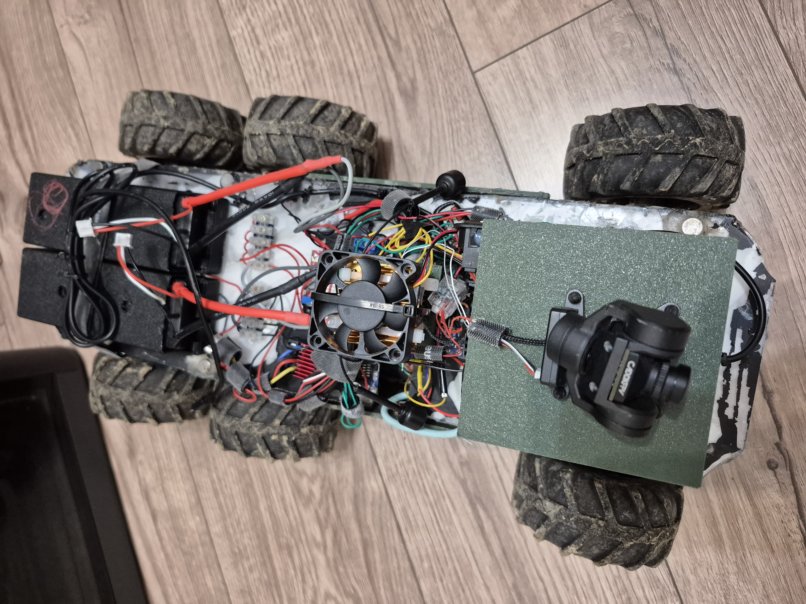

# Long-Range FPV RC Car System

[](https://github.com/vladyslav-semenets/rc-car/blob/main/LICENSE)
[](https://en.cppreference.com/)
[](https://developer.android.com/jetpack/compose)
[](https://www.semtech.com/products/wireless-rf/lora-connect/sx1262)
[](https://platformio.org/)

An advanced, long-range **FPV (First Person View) Remote-Controlled Vehicle System** featuring dual-mode **LoRa 868 MHz RF** + **4G LTE / Wi-Fi** telemetry, ultra-low latency control (**~23–28 ms end-to-end**), active **MPU-6050 gyro ESP counter-steering**, **speed-sensitive anti-rollover dynamics**, and **HD WebRTC video streaming**.

---

## Vehicle Showcase

<p align="center">
  
</p>

<p align="center">
  
  
</p>

* **Exterior**: Custom olive-green aerodynamic 3D-printed armored chassis with 6-wheel multi-terrain drivetrain, front high-lumen LED headlamp, and protective clear acrylic dome housing the CaddxFPV GM3 2-axis camera gimbal.
* **Interior**: Raspberry Pi 4 compute module with active cooling fan, dual Hobbywing QuicRun ESCs, MPU-6050 6-DOF IMU, power relay failsafe, and high-capacity battery packs.

---

## Key Features

* **Ultra-Low Latency LoRa 868 MHz Link (~23–28 ms total latency)**:
  * Uses an **ExpressLRS-style 8-byte compact binary frame** reducing LoRa airtime from 22 ms down to **5.5 ms** (SF7, BW 500 kHz, 22 dBm).
  * Continuous **50 Hz active state stream** with CRC-8 checksum integrity.
* **Android Ground Control Hub**:
  * Modern native Android client built with **Jetpack Compose**.
  * Bridges **DualShock 4 / DualSense 5 (Bluetooth Classic HID)** -> **Ground TX (BLE Nordic UART Service)**.
  * Trigger & stick deadband expansion with smooth linear normalization $[0.07..1.0] \rightarrow [0.0..1.0]$.
* **Speed-Sensitive Anti-Rollover Dynamic Steering**:
  * Automatically and progressively dampens steering throw as throttle and transmission gear increase, preventing high-speed chassis roll.
* **Powertrain Safety & Slew Rate Limiter**:
  * Hardware slew limiter ($25\text{ µs} / 10\text{ ms}$) prevents instant torque spikes from stripping drive gears.
  * Direction change protection enforces a $150\text{ ms}$ neutral hold to eliminate back-EMF voltage spikes.
  * **Rear-first axle sequencing lag** eliminates front torque steer on hard acceleration.
* **Active Gyro ESP Counter-Steering**:
  * Integrated **MPU-6050** calibrated specifically for **vertical chassis tower mounting** ($Y$-axis yaw rate via `0x45`).
  * Low-pass filter smoothing with automatic pause while driver is actively turning (zero CPU busy-waiting).
* **Self-Recovery "Unstuck" Mode**:
  * Automated 3-cycle escalating rocking routine to free the vehicle from obstacles with a single button press.
* **2-Axis FPV Camera Gimbal & HD Streaming**:
  * Smooth pan/tilt servo control for CaddxFPV GM3 gimbal.
  * MediaMTX + WebRTC low-latency streaming pipeline with adaptive bitrate (ABR) over 4G LTE.
* **Dual-Mode Transport**:
  * Pi automatically switches between the **8-byte compact RC frame** (over LoRa USB serial `/dev/ttyACM0`) and standard **MAVLink** (over UDP port `8565` for direct 4G/Wi-Fi).

---

## System Architecture & Latency Flow

```
[ DualShock 4/5 Gamepad ]
       │  ~5 ms  (Bluetooth Classic HID / USB-C OTG)
       ▼
[ Android Smartphone App ]
       │  ~6 ms  (BLE Nordic UART Service - NUS)
       ▼
[ Ground TX: Seeed XIAO ESP32-S3 + Wio-SX1262 ]
       │  ~5.5 ms (868.0 MHz LoRa RF Link - RadioLib)
       ▼
[ Rover RX: Seeed XIAO ESP32-S3 + Wio-SX1262 ]
       │  ~0.3 ms (USB CDC-ACM Serial /dev/ttyACM0)
       ▼
[ Raspberry Pi 4 (Rover Firmware) ]
       │  ~6 ms  (50 Hz pigpio DMA PWM)
       ▼
[ Dual ESCs, Steering Servo, 2-Axis Gimbal, MPU-6050 ]
```

| Link / Stage | Latency | Technology |
| :--- | :---: | :--- |
| **1. Gamepad -> Android Phone** | ~5 ms | Bluetooth Classic HID / Android InputManager |
| **2. Android Phone -> Ground TX** | ~6 ms | BLE Nordic UART Service (`WRITE_NO_RESPONSE`) |
| **3. Ground TX -> Rover RX** | **~5.5 ms** | 868.0 MHz LoRa (SX1262, SF7, BW 500 kHz, 8-Byte Frame) |
| **4. Rover RX -> Raspberry Pi 4** | ~0.3 ms | USB CDC-ACM Serial (`/dev/ttyACM0`, 115200 baud) |
| **5. Raspberry Pi -> Servos / ESCs** | ~6 ms | 50 Hz pigpio DMA Hardware PWM |
| **Total End-to-End Latency** | **~23 – 28 ms** | **Comparable to dedicated 2.4 GHz RC transmitters** |

---

## High-Speed 8-Byte Packet Protocol (ELRS Style)

```
[ 0xAA ] [ Seq ] [ Throttle ] [ Steering ] [ GimbalYaw ] [ GimbalPitch ] [ Flags ] [ CRC-8 ]
  Byte 0   Byte 1    Byte 2       Byte 3       Byte 4        Byte 5       Byte 6    Byte 7
```

* **`0xAA`**: Sync header byte.
* **`Seq`**: Incremental sequence counter (0–255).
* **`Throttle`**: Signed 8-bit integer (`-100` to `+100`%).
* **`Steering`**: 8-bit unsigned degrees (`0` to `180`°, center calibrated at `86`°).
* **`GimbalYaw`**: Signed 8-bit degrees (`-90` to `+90`°).
* **`GimbalPitch`**: Signed 8-bit degrees (`-45` to `+45`°).
* **`Flags`**: Bit 0 = Gyro ESP On/Off, Bit 1 = Unstuck active, Bits 3..6 = Transmission Gear (1–8).
* **`CRC-8`**: Standard polynomial `0x07` checksum.

---

## Hardware Components

| Component | Model / Part | Role |
| :--- | :--- | :--- |
| **Onboard Computer** | Raspberry Pi 4 Model B | Real-time vehicle control, PWM generation, video streaming |
| **LoRa Transceivers** | 2× Seeed XIAO ESP32-S3 + Wio-SX1262 | Long-range 868 MHz RF link (Ground TX + Rover RX) |
| **ESCs** | 2× Hobbywing QuicRun 1625 25A WP | Dual front/rear axle brushed motor speed controllers |
| **Steering Servo** | Standard High-Torque RC Servo | Digital steering (500–2500 µs PWM) |
| **IMU Sensor** | MPU-6050 6-DOF (I2C `0x68`) | Chassis yaw-rate sensing (vertical heatsink mount) |
| **Camera Gimbal** | CaddxFPV GM3 (2-Axis) | Real-time pan & tilt camera stabilization |
| **FPV System** | Walksnail Avatar HD Pro Kit / MS2109 | HD digital video feed with low-latency WebRTC relay |
| **Cellular Modem** | Huawei E3372h 4G LTE USB | High-bandwidth video and internet backup telemetry |
| **Power System** | LiPo Battery Pack + Relay Isolation | High-current power distribution |
| **Controller** | Sony DualShock 4 / DualSense 5 | Physical gamepad input |

---

## Repository Structure

```
rc-car-repo/
├── android-client/               # Android App (Kotlin / Jetpack Compose)
│   └── app/src/main/java/com/rccar/android/
│       ├── MainActivity.kt       # Fullscreen Compose UI & Settings Dialog
│       ├── CarController.kt      # 50 Hz active state stream, anti-rollover damping
│       ├── JoystickManager.kt    # DualShock HID input, 7% deadzone normalization, vibration
│       ├── BleManager.kt         # BLE NUS client for Ground TX
│       ├── RcPacket.kt           # ExpressLRS-style 8-byte binary frame encoder
│       ├── MAVLink.kt            # MAVLink v2 encoder/parser (UDP/fallback)
│       └── UDPManager.kt         # Direct UDP Wi-Fi / 4G socket client
├── lora-firmware/                # PlatformIO firmwares for Seeed XIAO ESP32-S3 + SX1262
│   ├── tx-ground-controller/     # BLE NUS Server -> 868 MHz LoRa TX
│   ├── rx-pi-bridge/             # 868 MHz LoRa RX -> USB CDC Serial (/dev/ttyACM0)
│   └── README.md                 # Hardware pinout and flashing guide
├── raspberry-pi-client/c/        # Raspberry Pi 4 Rover Firmware (C)
│   ├── main.c                    # Entry point, signal handling, dual serial/UDP startup
│   ├── rc-car.c / rc-car.h       # ESC slew rate limiter, MPU-6050 gyro, gimbal, unstuck
│   ├── serial.c / serial.h       # Dual-mode parser (8-byte compact RC + MAVLink fallback)
│   ├── udp.c / udp.h             # UDP MAVLink server (port 8565)
│   └── pigpio-mock.c / .h        # Mock pigpio for local development on macOS
├── client/c/                     # Legacy macOS Desktop Client (SDL2 + UDP MAVLink)
├── swift-client/ / macos-app/    # Native Swift / macOS Clients
├── mediamtx.yml                  # MediaMTX WebRTC / RTSP video streaming configuration
├── abr-controller.py             # Dynamic ffmpeg video bitrate controller for 4G LTE
└── abr-controller.service        # systemd unit for ABR controller
```

---

## Getting Started

### 1. Build & Run Raspberry Pi Firmware
On the Raspberry Pi 4:
```bash
cd raspberry-pi-client/c
cmake -S . -B build
cmake --build build
sudo ./build/raspberrypiclient
```
*(On macOS, CMake automatically links against `pigpio-mock.c` for local simulation).*

### 2. Flash LoRa Modules (PlatformIO)
Make sure [PlatformIO](https://platformio.org/) is installed:

* **Ground TX Module**:
  ```bash
  cd lora-firmware/tx-ground-controller
  pio run -t upload
  ```
* **Rover RX Bridge**:
  ```bash
  cd lora-firmware/rx-pi-bridge
  pio run -t upload
  ```

### 3. Install & Run Android App
1. Open `android-client/` in **Android Studio**.
2. Connect your Android smartphone via USB (or wireless ADB) and click **Run**.
3. Pair your **DualShock 4/5 Gamepad** via Bluetooth.
4. Power on the **Ground TX** module and tap **Scan / Connect** in the app.

---

## Gamepad Controls (DualShock / DualSense)

| Input | Function |
| :--- | :--- |
| **R2 Trigger** | Proportional Throttle Forward (speed-governed by gear) |
| **L2 Trigger** | Proportional Throttle Reverse / Brake |
| **Left Stick X** | Steering (with dynamic speed-sensitive damping & expo) |
| **Right Stick X** | Camera Gimbal Yaw (Pan) |
| **L1 / R1** | Camera Gimbal Pitch (Tilt Up / Down) |
| **Right Stick Click (R3)** | Transmission Gear Up (Gears 1–8, max speed 20% to 100%) |
| **Left Stick Click (L3)** | Transmission Gear Down |
| **D-Pad Up** | Initialize Car / Re-center Trim |
| **D-Pad Down** | Toggle Active MPU-6050 Gyro ESP Counter-Steering |
| **D-Pad Left / Right** | Fine-tune Steering Center Trim (`degreeOfTurns`) |
| **B Button** | Instant Neutral / Emergency Brake |
| **Y / A Buttons** | Start / Stop MediaMTX Camera Feed |

---

## License

This project is licensed under the **MIT License** - see the [LICENSE](LICENSE) file for details.

## Author

**Vladyslav Semenets**
* GitHub: [@vladyslav-semenets](https://github.com/vladyslav-semenets)
